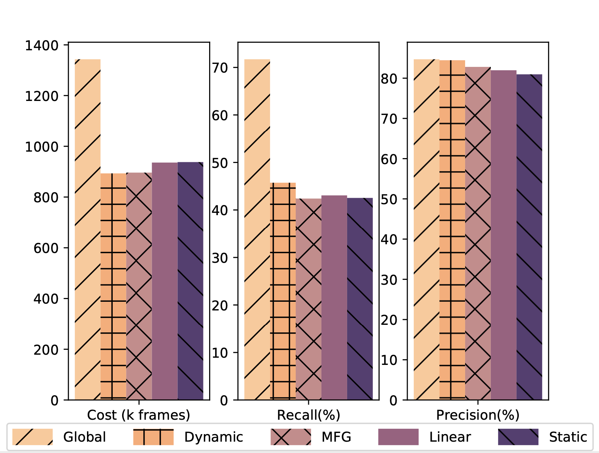

# Adaptive Cross-Camera Video Analytics at the Edge: A Mean-Field Game Approach

## Prerequisites

- Python 3.6
- GPU Memory >= 6G
- Numpy
- Pytorch 0.3+
- timm `pip install timm` for Swin-Transformer with Pytorch >1.7.0
- pretrainedmodels via `pip install pretrainedmodels`
- [Optional] apex (for float16)
- [Optional] [pretrainedmodels](https://github.com/Cadene/pretrained-models.pytorch)

## Getting started

### Installation

- Install Pytorch from http://pytorch.org/
- Install Torchvision from the source

### Dataset & Preparation

Download [Market1501 Dataset](http://www.liangzheng.com.cn/Project/project_reid.html) [[Google\]](https://drive.google.com/file/d/0B8-rUzbwVRk0c054eEozWG9COHM/view) [[Baidu\]](https://pan.baidu.com/s/1ntIi2Op)

Preparation: Put the images with the same id in one folder. You may use

```
python prepare.py
```

Remember to change the dataset path to your own path.

### Train ReID Network

Adapting the method from [Person_reID_baseline_pytorch](https://github.com/layumi/Person_reID_baseline_pytorch). We train a model by

```
python train.py --gpu_ids 0 --name ft_ResNet50 --train_all --batchsize 32  --data_dir your_data_path
```

`--gpu_ids` which gpu to run.

`--name` the name of model.

`--data_dir` the path of the training data.

`--train_all` using all images to train.

`--batchsize` batch size.

`--erasing_p` random erasing probability.

Train a model with random erasing by

```
python train.py --gpu_ids 0 --name ft_ResNet50 --train_all --batchsize 32  --data_dir your_data_path --erasing_p 0.5
```

### Generate correlation

In `test.py`, `extract_feature()` helps to generate the feature representations, and `spatial_temporal_distribution()` function is used to generate the spatial and temporal correlation.

### Mean-Field Game

The code to solve the MFG will not be published for now.

### Test

To track query objects, run 

```
python mfg.py --reid_method nn --split 32 --spatial 0.1 --temporal 0.1 
```

`--split` is the stepsize for your MFG.

`--spatial` is the threshold for spatial correlation filtering.

`--temporal` is the threshold for temporal correlation filtering.

### Results

Extensive experiments on a six-camera dataset demonstrate that, with the help of our dynamic correlation models, the overall workload can be reduced by 36% in general. For queries with a large search space, the tracking cost can be reduced by 40$\times$ with 6% precision improvement.




### Demonstration

All results drawing functions are in `utils.py`.

